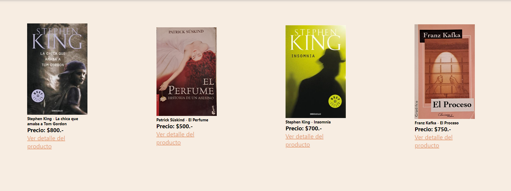

# E-Commerce: Libros usados y nuevos

Proyecto realizado para el curso de React.js, comisión 45060. Se trata de un e-commerce de libros usados y nuevos. Al igual que la moda circular con la ropa, este sitio se enfoca especialmente en libros usados, los cuales pueden seguir teninendo gran uso y mucha continuidad.
El usuario puede agregar y eliminar productos del carrito, así como ver su detalle. Puede navegar entre las rutas del sitio. Una vez que se finaliza la compra, deberá llenar un formulario el cual le da un número de seguimiento. 



## Librerías utilizadas

React Router Dom: Librería utilizada en React la cual nos facilita definir las distintas rutas y la navegación en nuestro sitio.

Firebase: Utilizada para almacenar los productos con sus características y las distintas ordenes de compra de los clientes. 

React-icons: utilizada para añadir íconos, como el carrito de compra.

React-spinners: esta librería nos presta servicios para agregar una animación de loading mientras se espera la animación.

### Pasos para iniciar el proyecto

```
git clone https://github.com/ezequielcardoxo/reactjs-comision-45060.git
```

Instalar las dependencias
```
npm start
```
Correr el proyecto en el navegador
```
npm start
```


